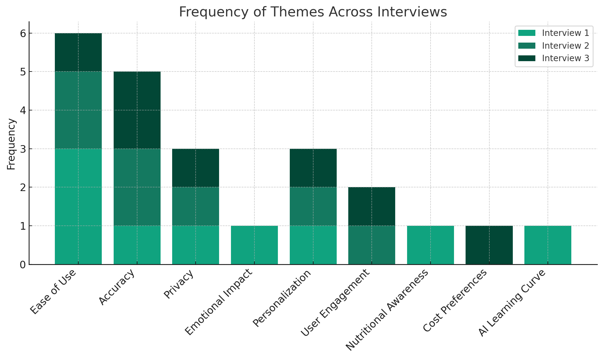

# NutriSnap Usability Evaluation Report

## Overview

This report summarizes the usability evaluation for the NutriSnap app, a mobile application designed for logging meals and tracking nutritional trends using AI-powered food recognition.

## Objective

The main objective is to understand user perceptions, concerns, interests, and desired features for an ML-powered food classification app.

## Methodology

- Structured generative interviews were conducted.
- Sessions were audio-recorded for thorough analysis.
- Open-ended questions were used to gauge user experiences and expectations.

## Key Findings

### Quantitative Analysis of Themes

The qualitative feedback from interviews was categorized into several key themes. The frequency of these themes across the interviews was then quantified to provide a clearer understanding of the areas most important to users:

- **Ease of Use and Convenience**: Most frequently mentioned, indicating significant importance.
- **Accuracy and AI Performance**: A consistent theme across all interviews, highlighting its importance in user perception.
- **Privacy and Security**: Moderate concern, suggesting the need for clear communication and robust measures.
- **Personalization and Customization**: A common theme, showing a desire for tailored experiences.
- **User Engagement and Motivation**: Gains focus in later interviews, indicating interest in social and gamified elements.
- **Nutritional Awareness and Health Education**: Specific interest shown in health education.
- **Cost and Subscription Preferences**: Brought up, indicating considerations about app pricing models.
- **User Expectations and AI Learning Curve**: Emphasized in the first interview, highlighting the importance of managing expectations.

### Detailed Themes

#### 1. Usability and Convenience

- Users prefer a quick, easy-to-use app with minimal disruption to daily routines.

#### 2. Accuracy and Diversity in Food Recognition

- Crucial for the app to be accurate in recognizing diverse foods and providing reliable nutritional information.

#### 3. Privacy Concerns

- Privacy is of moderate concern; clear communication about data use and security is important.

#### 4. Psychological Impact

- The app should focus on positive reinforcement and motivational messaging to avoid negative psychological impacts.

#### 5. Personalization and Gamification

- High interest in features that allow for personalization and engaging gamification elements.

#### 6. Nutritional Awareness and Improvement

- Users value feedback on eating habits and appreciate educational insights into healthier eating.

#### 7. Managing Expectations

- Important to set realistic expectations about the AI's learning curve and initial accuracy.

#### 8. Ease of Use and Quick Logging

- Preference for a straightforward process and quick-access logging features.

#### 9. Social and Gaming Elements

- Incorporating social features to enhance user engagement and motivation.

#### 10. Customized Meal Planning

- Interest in AI-powered meal planning that adapts to user habits.

#### 11. Focus on Core Functionality

- Extra features should complement the main functionality without causing distractions.

#### 12. User Interface and Data Representation

- Preference for visual data representation and a user-friendly interface.

## Quantitative Analysis of Themes - Visualization

The following chart visualizes the frequency of various themes as mentioned across the interviews:

This stacked bar chart displays the relative importance or focus on each theme in each interview, providing insights into which areas are most critical to our users.

## Recommendations

Based on the analysis, the following recommendations are made:

- **Simplicity and Speed**: Minimize disruption to the user’s cooking and eating routines.
- **Accuracy and Learning**: Focus on developing robust AI for precise food recognition.
- **Privacy**: Implement and clearly communicate strong privacy policies.
- **Psychology**: Use motivational messaging and positive reinforcement.
- **Personalization and Gamification**: Integrate engaging and customizable features.
- **User Engagement**: Incorporate social and gamified elements for enhanced motivation.
- **Nutritional Awareness**: Provide unique insights into behavior trends for self-improvement.
- **Expectation Management**: Clearly communicate the app's initial capabilities and personalization timeline.

## Conclusion

The NutriSnap app's usability evaluation underscores the need for simplicity, accuracy, personalization, and a positive user experience. Integrating these aspects will make the app more appealing and effective for its users.

## Additional Information

- [View on GitHub](https://github.com/NutriSnap/NutriSnap)
- [NutriSnap Homepage](https://nutrisnap.github.io/)
