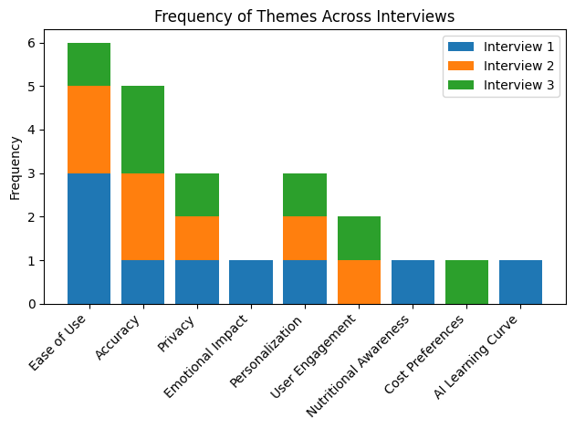

# Feedback Summary

## Open-Ended Interview Feedback

### Themes and recommendations from open-ended interviews discussing the concept of an AI food logging app:

1. **Ease of Use**:

   - The app should not be time-consuming and logging food should not add significant time overhead to the user's daily routine.
   - Searching databases for exactly the right food can be frustrating, and an app that does this automatically based on a photo be highly desirable.

2. **Accuracy and Recognition of Diverse Foods**:

   - Importance of the AI model recognizing traditional Hawaiian and other ethnic foods.

3. **Privacy**:

   - Two of three users did not care about or have any concerns about privacy.
   - One user had significant concerns about privacy and emphasized the need for clear communication about data usage, storage, and security.
   - Options like end-to-end encryption and storing data on the user's device were viewed positively.

4. **Personalization and Variation in Desired Features**:
   - Variation in desired features, but meal planning, workout tracking, goal tracking, and competitions with friends were popular.
   - Idea of creating an avatar or character to represent the AI.
   - One participant had previously used three different apps simultaneously for food preparation and logging: one to generate recipes based on food in the fridge, one for a photo food journal, and one to track macronutrients and calories. This person wished for a single app to fulfill all three functions.

## User Testing Feedback

### Feedback focused more on the app’s design than interactivity, as the CRUD features are not fully implemented yet.

#### Screens

##### 1. Login Screen:

- Warm colors and fruit imagery give a healthy and welcoming impression.
- Design appeals to new users or those wanting to start healthier habits.
- Suggest incorporating a photo or loop video showing high-protein meal preparation to attract experienced users.

##### 2. Dashboard:

- Positive feedback on the food breakdown chart (processed, unprocessed, ultra-processed).
- Appreciation for visible accomplishments and challenges.
- Importance of mindfulness features.
- **Desire for detailed macronutrient breakdown.**
- **Requested push notifications and a checklist on the dashboard for meal logging and other task reminders.**

##### 3. Journal:

- Card layout with half picture, and half information is well-received.
- **Suggestion to add meals as headings with snaps for each meal underneath.**
- **Request for inclusion of macronutrient details in the meal cards (protein, fat, carbohydrates).**

##### 4. Trends Page:

- Interest in viewing weekly or monthly statistics in a chart format.
- Desire to see macronutrient or processed percentage trends over time.

##### 5. Challenges:

- Interest in workout and step goal challenges.
- Suggestion for a leaderboard and the ability to form and compete within friend groups.

##### 6. Friends:

- **Support for an instagram social feed where users can share meals and progress.**
- Endorsement of using the platform for dietitians/personal trainers to offer services.

##### 7. Coach:

- **Willingness to pay for AI-based and human coaching services, with a preference for video interaction with human coaches.**

##### 8. Settings:

- **Desire for the ability to silence social features.**
- Suggestion to add a specific goals page for detailed goal-setting.

##### 9. Extra Features Desired:

- Request for an exercise tracking and workout planning feature.

##### 10. Food Logging Activity:

    - Positive feedback on the quick and easy logging process.
    - Preference for a warmer, less stark color scheme in the app's design.

##### 11. Journal Page Activity:

    - Recommendation to include percentage numbers and macronutrient breakdown on meal cards.

##### 12. Dashboard Ring Analysis Activity:

    - Affirmation of the clarity and usefulness of the nutrition breakdown ring.

### Final Critiques and Recommendations

#### 1. Visual Design Update:

- Revise color scheme to be more modern and visually appealing, taking inspiration from apps like 24-hour fitness.
- Implement a warmer color palette, potentially with a darker background and bright accents.

#### 2. Navigation and Layout:

- Maintain the current layout of the bottom bar for its intuitive order.
- Introduce processed/unprocessed/ultraprocessed food categorization in the app onboarding screens.

#### 3. Personal Desires and Preferences Reflection:

- Incorporate missing macronutrient information to meet user expectations.
- Add workout features to enhance the app's appeal and functionality.

#### 4. Enhanced Communication Features:

- **Add a chat box icon in the app bar for quick access to messages with friends and the AI bot.**

### Plans for the Future:

- Conduct two more user testing interviews before the end of the semester.
- Finish CRUD functions by the end of the semester.
- - The app has been submitted as a candidate capstone project for ICS 496 next semester.
