# NutriSnap

Transform your meals into nutritional insights through intelligent, camera-powered food logging.

<div align="center">
    <p float="left">
            <a href="#login"></a>
            <a href="#about"></a>
            <a href="#dashboard"></a>
            <a href="#journal"></a>
            <a href="#trends"></a>
            <a href="#profile"></a>
            <a href="#settings"></a>
            <a href="#camera"></a>
            <a href="#social"></a>
            <a href="#mysnaps"></a>
            <a href="#mysnapsmenu"></a>
            <a href="#coach"></a>
            <a href="#challenges"></a>
            <a href="#imagecroptool"></a>
    </p>
        <!-- 
        
        
        
        
        
        
        
        
        
                
        
        
        
    </p> -->
</div>

## Table of Contents

- [Motivation](#motivation)
- [Goals](#goals)
- [Features](#features)
- [Usage](#usage)
- [Installation](#installation)
- [Development Status](#development-status)
- [Screenshots](#screenshots)
- [About Us](#about-us)

## Motivation

### Problem:

- Chronic diseases linked to dietary habits wreak havoc on global health.
- Traditional dietary assessment methods are prone to substantial inaccuracies.
- Current food logging applications can be tedious and encourage consumption of processed foods.

### Solution:

- Employ machine learning to intelligently recognize and quantify foods, evolving to understand your diet over time.
- Classify foods based on their level of processing, and visually present dietary trends and quality.
<figure>
    
    <figcaption>
        <p align='right'>Image generated in collaboration with <a href='https://midjourney.com/'>AI</a>.
        </p>
    </figcaption>
</figure>

## Goals

Leverage pioneering ML technology to effortlessly identify and track your nutrition, offering a transparent window into your dietary habits. NutriSnap is not just about counting calories, but understanding their nutritional impact. Navigate toward a healthful lifestyle, guided by innovative technology and authentic expertise.

## Features

- **Automated Food Recognition:** Utilize ML to identify and log foods and beverages.
- **Nutritional Insights:** Dive deep into the nutritional composition of your meals.
- **Dietary Quality Analysis:** Visualize the processing level of your consumed foods over time.
- **Progress Tracking:** Keep track of your dietary journey and set healthful goals.

## Usage

### First Time User

1. **Snap & Log:** Capture your meal with NutriSnap and let it log the nutritional info.
2. **Analyze & Learn:** Gain insights into your eating patterns and nutritional intake.


### Returning User

- **Review & Reflect:** Look over your historical data and recognize patterns.
- **Adjust & Optimize:** Use insights to make informed dietary adjustments.

---

> 🔥 **Hot New Features**
>
> - **Celebrate & Share:** Share your achievements and progress with friends and family.
> - **Connect & Inspire:** Connect with friends and family and share your nutritional journey.
> - **Coach & Support:** Get personalized feedback and recommendations from your NutriSnap coach.
> - **Customize & Personalize:** Customize your NutriSnap experience and manage your account settings.
> - **Track & Visualize:** Visualize your nutritional trends, understanding the ebbs and flows of your dietary habits over time.

To get a better understanding of the features and how to use them, please refer to the Screen Shots section below.

### Prerequisites

- [Flutter](https://flutter.dev/docs/get-started/install)
- [Firebase](https://firebase.google.com/docs/flutter/setup)

## Installation

```bash
    git clone https://github.com/NutriSnap/NutriSnap.git
```

#### Installing Packages

```bash
    flutter pub get
```

#### Running

```bash
    flutter run -d --debug
```

## Development Status

- Project Board 1: [NutriSnap Startup Board (ML1)](https://github.com/orgs/NutriSnap/projects/1/views/2)
- Project Board 2: [NutriSnap Development Board (ML2)](https://github.com/orgs/NutriSnap/projects/4)
- Project Board 3 (most recent): [NutriSnap M3](https://github.com/orgs/NutriSnap/projects/5/views/1)

## Screenshots

<a name="login"></a>

### Login Page

The gateway to NutriSnap, ensuring secure and personalized user experiences.

|                Signin Mode                |                      Signup                      |
| :---------------------------------------: | :----------------------------------------------: |
|  |  |

<a name="dashboard"></a>

### Dashboard View

Your nutritional overview, presenting a snapshot of your current and historical dietary habits. Gain insights into your dietary habits and track your progress over time. This page provides a comprehensive overview of your nutritional journey.

|                  Light Mode                   |                        Dark Mode                        |
| :-------------------------------------------: | :-----------------------------------------------------: |
|  | 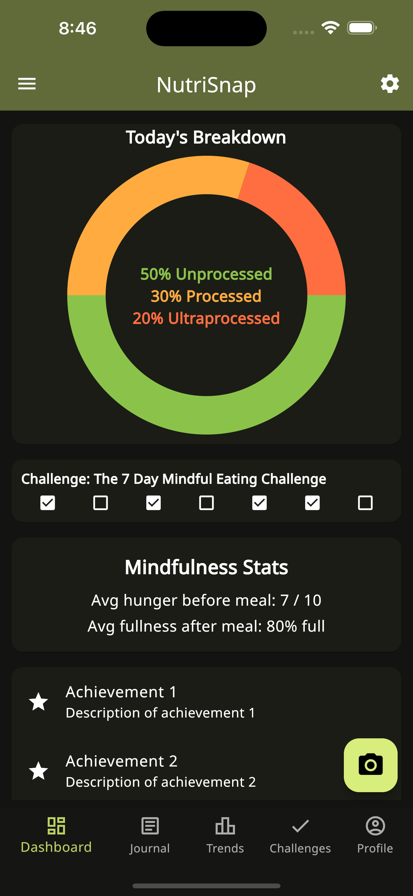 |

<a name="about"></a>

### About View

Learn more about NutriSnap and the team behind it. The about page provides a comprehensive overview of the application and its features. It also links directly to the documentation and the GitHub repository.

|              Light Mode               |                    Dark Mode                    |
| :-----------------------------------: | :---------------------------------------------: |
| 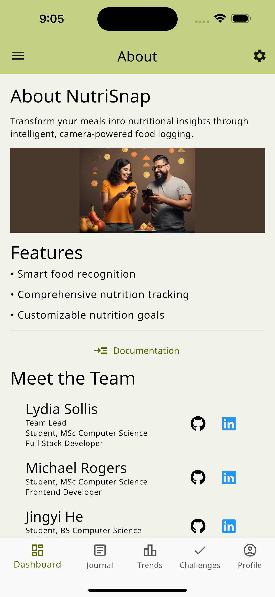 | 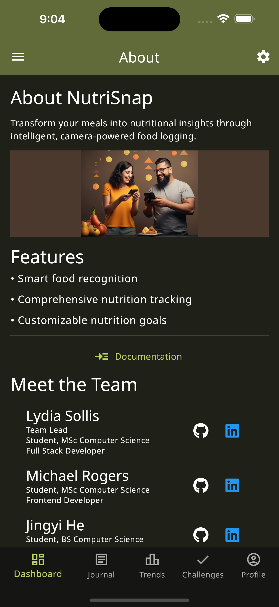 |

<a name="challenges"></a>

### Challenges View

Celebrate your nutritional victories and keep track of your progress with insightful and motivational badges.

|                   Light Mode                    |                         Dark Mode                         |
| :---------------------------------------------: | :-------------------------------------------------------: |
|  | 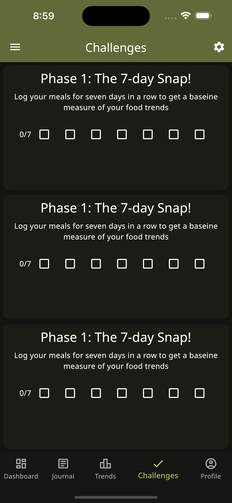 |

<a name="coach"></a>

### Coach View

Get personalized feedback and recommendations from your NutriSnap coach. The coach view provides a comprehensive overview of your nutritional journey and provides insights into your dietary habits.

|              Light Mode               |                    Dark Mode                    |
| :-----------------------------------: | :---------------------------------------------: |
|  |  |

<a name="profile"></a>

### Profile View

Customize your NutriSnap experience and manage your account settings. Toggle between light and dark mode, and adjust your profile settings. Turn on/off notifications and mindfullness reminders.

|                Light Mode                 |                      Dark Mode                      |
| :---------------------------------------: | :-------------------------------------------------: |
| 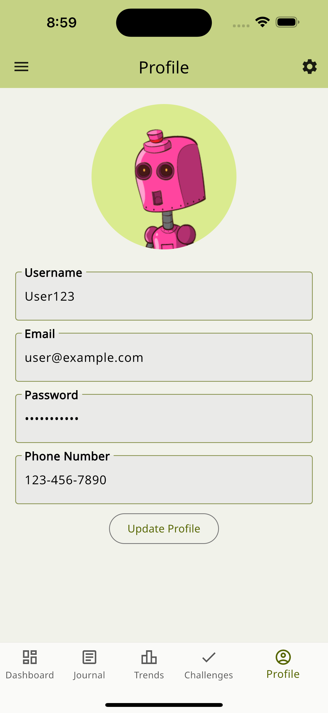 | 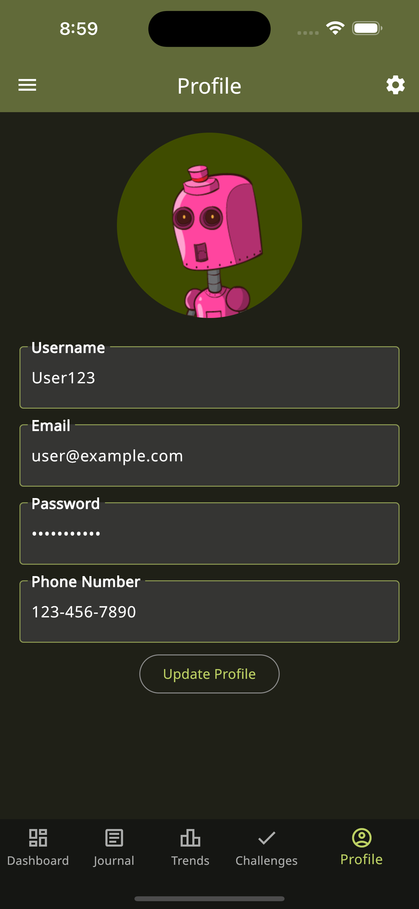 |

<a name="camera"></a>

### Camera View

Capture your meals with NutriSnap and let it log the nutritional info. The camera view allows you to take a picture of your food and log it into your food journal. The camera view also provides a cropping tool to allow the user to crop the image to their desired size.

|               Light Mode                |                     Dark Mode                     |
| :-------------------------------------: | :-----------------------------------------------: |
|  |  |

<a name="imagecroptool"></a>

### Image Crop Tool

Crop your images to your desired size. The image crop tool allows the user to crop the image to the size that fits best for their food log, user profile pic, social card banner, or other photos, allowing the user to crop out any unwanted parts of the image. The image crop tool was largely based on an example provided on the <a src='https://www.geeksforgeeks.org/how-to-create-image-cropper-app-in-flutter/#'>geeksforgeeks</a> website but will be adpated further to fit the needs of the NutriSnap application and the user.


<a name="social"></a>

### Social View

Connect with friends and family, sharing your nutritional journey and celebrating your successes. The social view allows you to connect with friends and family and share your nutritional journey. The social view also provides a feed of your friends' nutritional journey.

|               Light Mode                |                     Dark Mode                     |
| :-------------------------------------: | :-----------------------------------------------: |
|  |  |

<a name="journal"></a>

### Journal View

Maintain a daily log of your meals, providing a detailed overview of your dietary patterns. The journal view allows you to view your food log and provides insights into your dietary habits. Serves as a confirmation page for the user to confirm the food they have logged.

|                Light Mode                 |                      Dark Mode                      |
| :---------------------------------------: | :-------------------------------------------------: |
|  |  |

<a name="settings"></a>

### Settings View

Customize your NutriSnap experience and manage your account settings. Toggle between light and dark mode, and adjust your profile settings. Turn on/off notifications and mindfullness reminders.

|                 Light Mode                  |                       Dark Mode                       |
| :-----------------------------------------: | :---------------------------------------------------: |
|  | 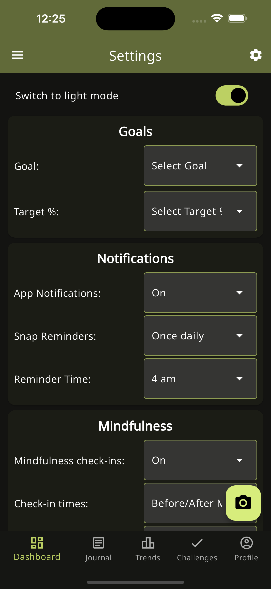 |

<a name="mysnaps"></a>

### MySnaps Dialogue

Experience user-friendly interactions and confirmations throughout your NutriSnap journey. This page allows you to view your food log and provides insights into your dietary habits. Serves as a confirmation page for the user to confirm the food they have logged.

|                Light Mode                 |                      Dark Mode                      |
| :---------------------------------------: | :-------------------------------------------------: |
| 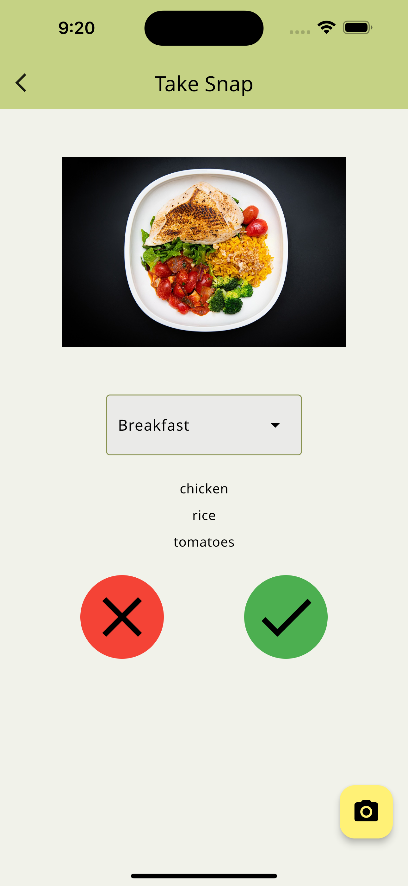 |  |

<a name="mysnapsmenu"></a>

### MySnapsMenu Dialogue

Experience user-friendly interactions and confirmations throughout your NutriSnap journey. This dialogue allows you to select the meal type for your food log. The meal type is used to categorize your food log and provide insights into your dietary habits.

|                    Light Mode                     |                          Dark Mode                          |
| :-----------------------------------------------: | :---------------------------------------------------------: |
| 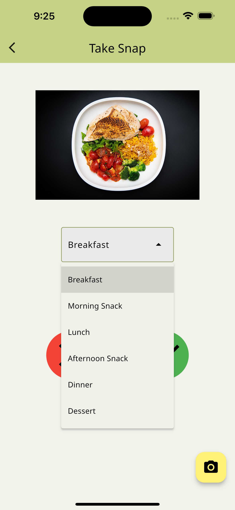 | 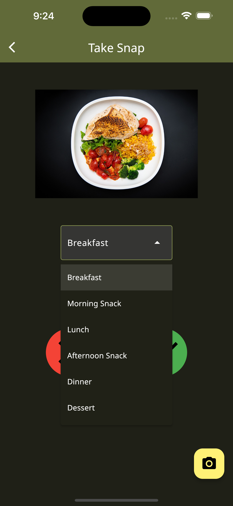 |

<a name="trends"></a>

### Trends View

Visualize your nutritional trends, understanding the ebbs and flows of your dietary habits over time. Beautiful charts and graphs provide a comprehensive overview of your nutritional journey.

|               Light Mode                |                     Dark Mode                     |
| :-------------------------------------: | :-----------------------------------------------: |
|  | 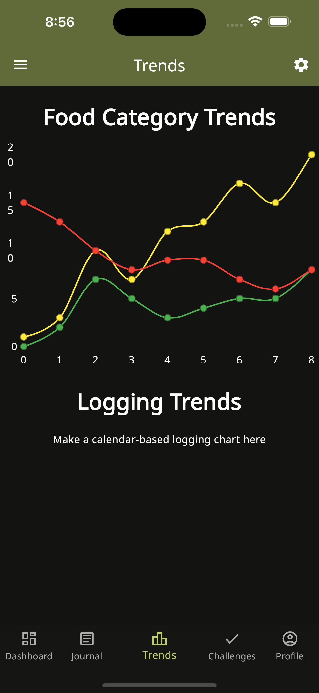 |

<a name="imagecroptool"></a>

## Data Model

The data model encompasses a holistic representation of a user's nutritional and meal tracking application. Central to the model is the `UserData`, which maintains user details and settings, linking to their meals, snaps (visual representations of their meals), and their progress in challenges. Each snap captures specifics like its contents and images. `Meal` records are detailed with processed food percentages, and they can be associated with multiple snaps. Users can earn `Badges`, have specific app `Settings`, and track `Trends` in their eating habits. `Challenges` provide users with goals, and their progress is tracked in `ChallengeProgress`. Additionally, foods in snaps have individual item details maintained in `SnapFoodItem`. The model offers an interconnected system for users to visualize, track, and improve their eating habits.


## About Us

NutriSnap is designed, implemented, and maintained by a team consisting of three members:

> 🚀 **Lydia Sollis**, NutriSnap’s inspiring team lead, combines her experiences from military IT management to emerging full-stack developer while advancing her Computer Science mastery at the University of Hawaii. With NutriSnap pivotal to her thesis, it reflects her enthusiasm for technology and healthy living. Lydia's diverse development projects showcase her proficiency in various technologies and frameworks like Java, Python, JavaScript, React, and Spring Boot. Balancing technical acumen with leadership qualities – reliable teamwork, effective communication, and skilled conflict management – she harmoniously merges technology with mindful eating while enjoying coffee, coding, and spectacular hikes. NutriSnap thrives under her diligent leadership and genuine dedication to connecting tech with conscious nutrition.
>
> <a href="https://github.com/lsollis/"></a><a href="https://www.linkedin.com/in/lydia-sollis/"></a>

> 💻 **Michael Rogers**, pursuing an MSc in Computer Science at the University of Hawaii at Manoa, intertwines a rich history as a retired Air Force veteran with innovative technology through notable work in collaborative software development with the Scalable Analytics and Informatics Lab (SAIL) and the Laboratory for Advanced Visualization & Applications (LAVA). Embarking on crafting the first mobile app with "NutriSnap," he's ignited by a keen desire to employ technology in creating meaningful, user-focused products, synthesizing his veteran insights with a contemporary tech approach.
>
> <a href="https://github.com/mlr77"></a> <a href="https://www.linkedin.com/in/michael-rogers-a2a1152a/"></a>

> 💻 **Jingyi He**, a meticulous Computer Science student and Learning Assistant at the University of Hawaii at Manoa, balances academic rigor, professional growth, and a fulfilling personal life with aplomb. Her commitment is evident through notable academic projects like a banking database simulation, which transitioned from C to C++, showcasing her robust programming and problem-solving skills. With capabilities in Problem Solving, Teaching, and Teamwork, along with practical experience in Dart/Flutter and GitHub project management, Jingyi brings a vibrant, well-rounded contribution to the "NutriSnap" project, significantly influencing documentation and collaborative development.
>
> <a href="https://github.com/jing2003"></a> <a href="https://www.linkedin.com/in/jingyi-he-b16b0222b/"></a>
