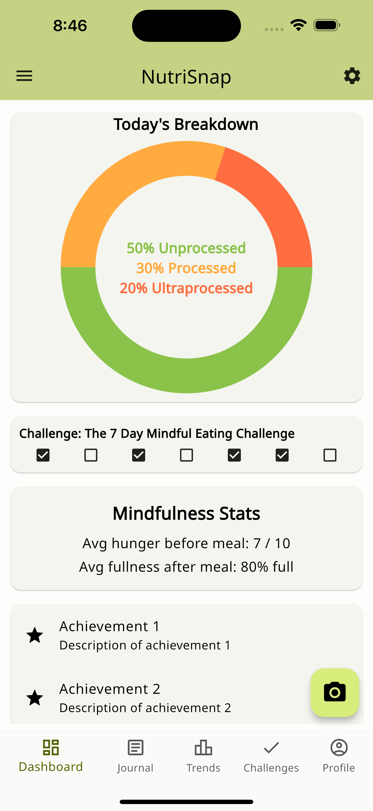
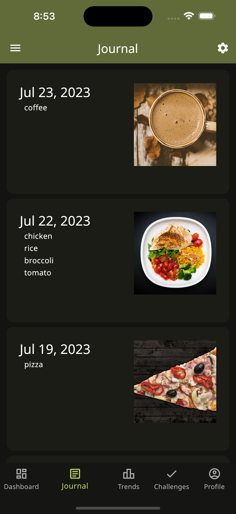
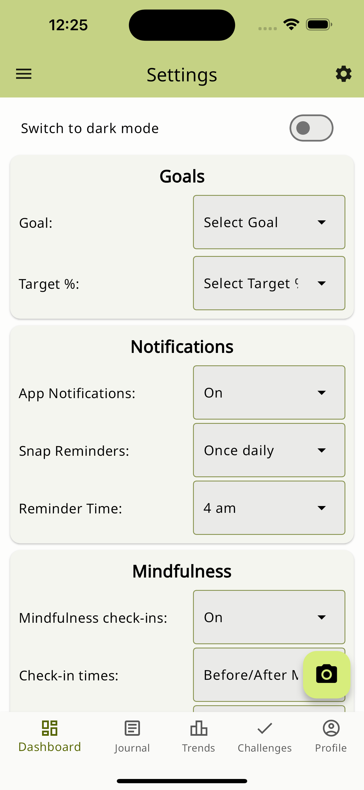

# NutriSnap

Transform your meals into nutritional insights through intelligent, camera-powered food logging.

## Table of Contents

- [Motivation](#motivation)
- [Goals](#goals)
- [Features](#features)
- [Usage](#usage)
- [Installation](#installation)
- [Development Status](#development-status)
- [Screenshots](#screenshots)
- [About Us](#about-us)

## Motivation

### Problem:

- Chronic diseases linked to dietary habits wreak havoc on global health.
- Traditional dietary assessment methods are prone to substantial inaccuracies.
- Current food logging applications can be tedious and encourage consumption of processed foods.

### Solution:

- Employ machine learning to intelligently recognize and quantify foods, evolving to understand your diet over time.
- Classify foods based on their level of processing, and visually present dietary trends and quality.


<!--  -->

## Goals

Leverage pioneering ML technology to effortlessly identify and track your nutrition, offering a transparent window into your dietary habits. NutriSnap is not just about counting calories, but understanding their nutritional impact. Navigate toward a healthful lifestyle, guided by innovative technology and authentic expertise.

## Features

- **Automated Food Recognition:** Utilize ML to identify and log foods and beverages.
- **Nutritional Insights:** Dive deep into the nutritional composition of your meals.
- **Dietary Quality Analysis:** Visualize the processing level of your consumed foods over time.
- **Progress Tracking:** Keep track of your dietary journey and set healthful goals.

## Usage

### First Time User

1. **Snap & Log:** Capture your meal with NutriSnap and let it log the nutritional info.
2. **Analyze & Learn:** Gain insights into your eating patterns and nutritional intake.


### Returning User

- **Review & Reflect:** Look over your historical data and recognize patterns.
- **Adjust & Optimize:** Use insights to make informed dietary adjustments.

### Prerequisites

- [Flutter](https://flutter.dev/docs/get-started/install)
- [Firebase](https://firebase.google.com/docs/flutter/setup)

## Installation

```bash
    git clone https://github.com/NutriSnap/NutriSnap.git
```

#### Installing Packages

```bash
    flutter pub get
```

#### Running

```bash
    flutter run -d --debug
```

## Development Status

- Project Board 1: [NutriSnap Startup Board](https://github.com/orgs/NutriSnap/projects/1/views/2)
- [Milestones](https://github.com/NutriSnap/NutriSnap/milestones)
- [Milestone 1](https://github.com/NutriSnap/NutriSnap/milestone/1)
- [Milestone 2](https://github.com/NutriSnap/NutriSnap/milestone/2)

## Screenshots

### Login Page

The gateway to NutriSnap, ensuring secure and personalized user experiences.


### Signup View

_Note: (Include description about the Signup view if applicable, as it was not in the images list)_

### Achievements View

Celebrate your nutritional victories and keep track of your progress with insightful and motivational badges.


### Camera/Snap Page

Seamlessly log your meals by capturing them with NutriSnap's intelligent camera functionality.

|                 Light Mode                  |                       Dark Mode                       |
| :-----------------------------------------: | :---------------------------------------------------: |
|  |  |

<!--
### Coach View

Gain insights and advice from your virtual nutritional guide, assisting you on your healthful journey.

 -->

### Dashboard View

Your nutritional overview, presenting a snapshot of your current and historical dietary habits.



### Journal View

Maintain a daily log of your meals, providing a detailed overview of your dietary patterns.

|                Light Mode                 |                      Dark Mode                      |
| :---------------------------------------: | :-------------------------------------------------: |
|  |  |

### Settings View

Customize your NutriSnap experience and manage your account settings.



### Snackbar Confirmation Dialogue

Experience user-friendly interactions and confirmations throughout your NutriSnap journey.


### Trends View

Visualize your nutritional trends, understanding the ebbs and flows of your dietary habits over time.

|               Light Mode                |                     Dark Mode                     |
| :-------------------------------------: | :-----------------------------------------------: |
|  |  |

## About Us

NutriSnap is designed, implemented, and maintained by a team consisting of three members:

- Lydia Sollis
- Michael Rogers
- Jingyi He
